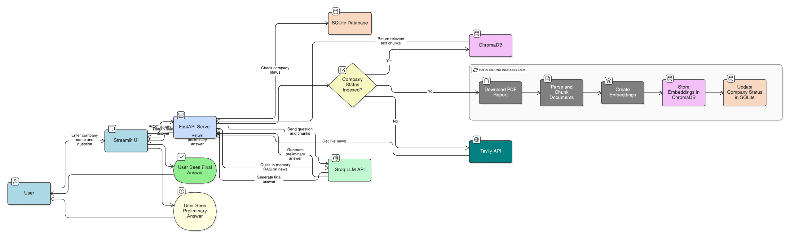

# Financial Analyst AI Agent 🤖

This project is a sophisticated AI-powered financial analyst designed to answer complex questions about public companies. It leverages a multi-source, asynchronous Retrieval-Augmented Generation (RAG) architecture to provide users with both real-time insights from live news and deep analysis from official financial reports.

The application is deployed as a multi-container service and features a seamless user experience that provides immediate answers while handling heavy data processing in the background.

## 🚀 Live Demo

This application is deployed on Hugging Face Spaces. You can try it out live!

[](https://huggingface.co/spaces/masha7/Financial-Analyst)

## Key Features

* **🧠 Dynamic & On-Demand Data Ingestion:** The system starts with no knowledge and automatically fetches, processes, and caches data for a company the very first time a user asks about it.
* **🌐 Multi-Source RAG:** The agent synthesizes information from multiple sources to form a comprehensive answer:
    * **Official Reports (PDFs):** Automatically finds and downloads the latest reports from the web.
    * **Live News (Web):** Fetches real-time news articles for up-to-the-minute context.
    * **Stock Data (API):** Caches fundamental stock data where available.
* **🚀 Asynchronous Processing:** For new companies, the app provides an immediate preliminary answer based on live news while the slow, deep analysis of the full report runs as a background task. The UI then automatically updates when the full analysis is complete.
* **📄 Advanced Document Parsing:** Utilizes a hierarchical chunking strategy with `unstructured`, **Poppler**, and **Tesseract (OCR)** to intelligently parse complex PDFs, preserving the structure of tables and extracting text from images.
* **☁️ CI/CD Deployment:** The entire application is containerized with **Docker** and deployed on a modern cloud platform with continuous deployment enabled from the Git repository.

## Architecture Overview

The application is built on a decoupled frontend and backend architecture, following the flow illustrated below.



`User -> Streamlit UI -> FastAPI Backend -> RAG Agent -> ChromaDB / Live APIs -> Groq LLM`

1.  A user interacts with the **Streamlit UI**.
2.  The UI sends an API request to the **FastAPI Backend**.
3.  The backend checks its **SQLite** cache.
4.  If the company is new, it performs a **Live RAG** on real-time data for an instant answer and triggers a **background task**.
5.  The background task downloads, parses, and indexes the full report into a **ChromaDB** vector store.
6.  If the company is already cached, the **RAG Agent** retrieves context from ChromaDB and the SQLite cache, sending it to the **Groq API (LLM)** for the final answer.

## Technology Stack

* **Backend:** FastAPI, Uvicorn
* **Frontend:** Streamlit
* **AI & Data:** LangChain, ChromaDB (Vector Store), `unstructured` (Document Parsing), Hugging Face `sentence-transformers` (Embeddings), Groq (LLM Generation)
* **Data Sources:** Tavily API (News), Alpha Vantage (Stock Data)
* **Containerization & Deployment:** Docker, Hugging Face Spaces
* **System Dependencies:** Poppler, Tesseract

## How to Run Locally

1.  **Install Dependencies:**
    ```bash
    poetry install
    ```
2.  **Configure Environment:**
    * Create a `.env` file in the project root.
    * Add your API keys: `TAVILY_API_KEY`, `GROQ_API_KEY`, `ALPHA_VANTAGE_API_KEY`.

3.  **Initialize Database:**
    ```bash
    poetry run python -m src.utils.database_handler
    ```
4.  **Run the Backend Server (Terminal 1):**
    ```bash
    poetry run uvicorn src.main:app --reload
    ```
5.  **Run the Frontend App (Terminal 2):**
    ```bash
    poetry run streamlit run app.py
    ```
